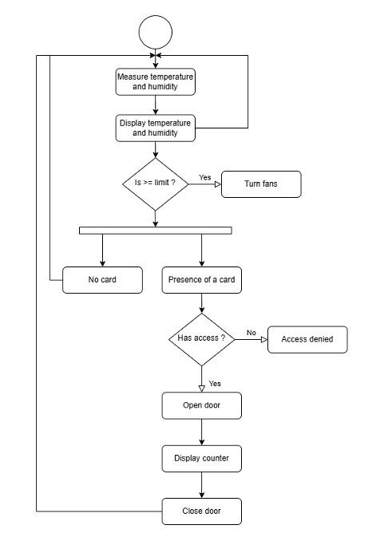
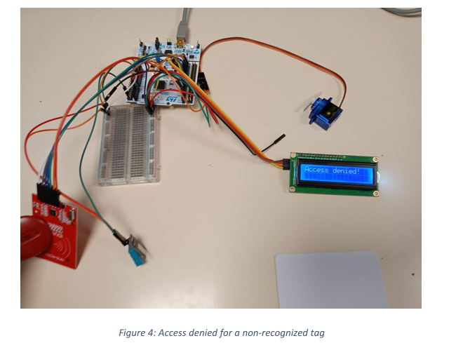
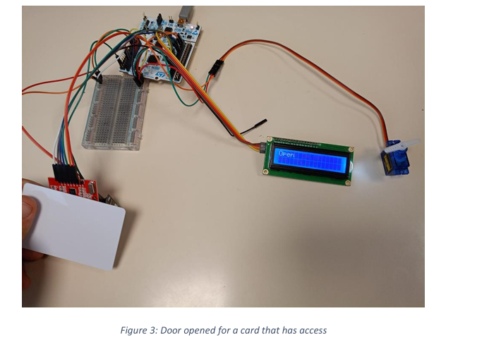
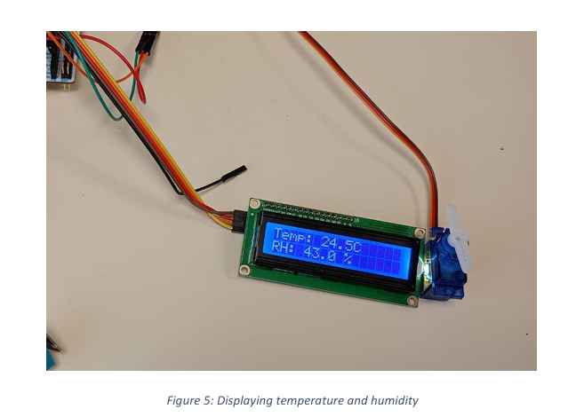

# 🔬 Smart Laboratory Management System

This project implements an intelligent system to manage laboratory environments efficiently and securely in an academic setting. Designed using the **STM32F411RE microcontroller**, the system features real-time environmental monitoring, RFID-based access control, automated response mechanisms, and local/remote data logging.

---

## 📸 Project Images

> Add photos of your hardware setup, LCD output, RFID scans, wiring, or circuit diagrams here.
> Example:

 
<em>System activity diagram</em>  

 
<em>Access denied screen</em>  

 
<em>Access granted screen</em>  

 
<em>LCD showing environmental data</em>

---

## 📚 Project Overview

The goal of this project is to develop a **Smart Laboratory** that supports:

* 🌡️ **Environmental Monitoring** (temperature & humidity)
* 🔐 **Access Management** (RFID-based user control)
* ⚙️ **Automated Control** (climate systems, door servo)
* 🖥️ **Local Display** (LCD for conditions and access status)
* 💾 **Data Logging** (via UART to remote system with PuTTY)

---

## 🛠️ System Architecture

### 🔧 Hardware Components

| Component           | Function                                                         |
| ------------------- | ---------------------------------------------------------------- |
| STM32F411RE         | Central microcontroller (data handling, sensor/actuator control) |
| RFID Reader (RC522) | Identifies users via RFID cards                                  |
| DHT11 Sensor        | Measures ambient temperature and humidity                        |
| LCD Display (I2C)   | Shows live environmental status and occupancy                    |
| Servo Motor         | Opens/closes door upon access validation                         |
| UART Communication  | Sends logs to PC via PuTTY for monitoring                        |

### 🔌 Communication Protocols

* **SPI**: Between STM32 and RFID Reader
* **I2C**: Between STM32 and LCD Display
* **UART**: For serial communication with external systems (e.g., PC)
* **PWM**: Used to control the servo motor for door operation

---

## 🌡️ Environmental Monitoring

* Uses DHT11 sensor for real-time temperature and humidity tracking
* Automatically triggers ventilation or AC systems:

  * > 25°C → activate fan/AC
  * > 60% humidity → activate dehumidifier

---

## 🔐 Access Control

* **RFID-based authentication**

  * Authorized UIDs → grant access + open door via servo motor
  * Unauthorized UIDs → access denied
* **Logging**

  * Entry/exit timestamps stored locally and/or sent via UART
* **Occupancy Tracking**

  * Keeps a live count of people inside the lab

---

## 🖥️ Local Display

The LCD displays:

* Temperature (°C)
* Humidity (%)
* Door status (Open/Closed)
* Occupancy count
* Countdown for automatic door closure

---

## 🌐 Optional Remote Integration

* **UART + PuTTY**

  * Data transmitted to a server/computer for logging
* **Benefits**:

  * Historical data analysis
  * Remote access to lab metrics
  * Enhanced security and accountability

---

## 📌 Future Improvements

* Cloud-based dashboard for live monitoring
* Integration with mobile app for user alerts
* Support for additional environmental sensors (CO2, light, etc.)

---

## 🧑‍💻 Authors

* **Zakariae FANZI**
* **Chahine CHEBBI**

**Supervisor**: Mr. RAOOF KOSAI
4A ENSIM ASTRE – 2025

